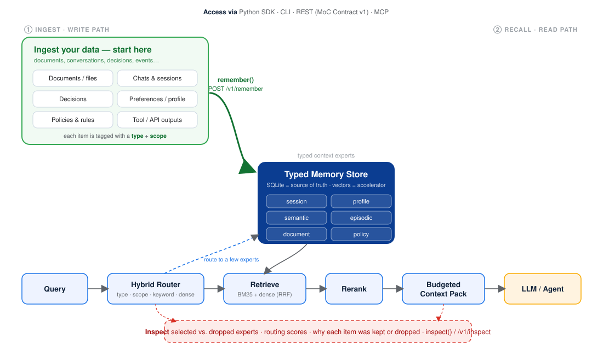

<div align="center">


### The inspectable context layer for agent memory

**Matrix Context routes each query to a small set of _typed context experts_, retrieves with hybrid lexical + dense fusion, and assembles a token‑budgeted, fully explainable context pack — so any agent gets the right context, in less of it, and you can see exactly why.**

[](https://github.com/agent-matrix/matrix-context/actions/workflows/ci.yml)
[](moc_contract/README.md)
[](moc_contract/README.md)
[](moc_contract/mcp-mapping.md)
[](LICENSE)
[](pyproject.toml)
[](https://huggingface.co/spaces/ruslanmv/matrix-context-console)

[Quickstart](#quickstart) · [Live demo](https://huggingface.co/spaces/ruslanmv/matrix-context-console) · [Tutorials](#tutorials) · [Architecture](#architecture) · [The standard](#the-standard-moc-contract-v1) · [Benchmark](#benchmark) · [Cite](#citation)

</div>

---

## Overview

Classic retrieval‑augmented generation embeds everything into one flat index and retrieves the nearest chunks for every query. For agent memory — which mixes user preferences, project decisions, code, policies, episodes, and documents — that is wasteful and opaque: it spends the prompt budget indiscriminately and cannot explain its choices.

**Matrix Context** implements **Mixture‑of‑Contexts retrieval (MoC‑RAG)**. It treats the memory store as a set of typed *context experts* (session, profile, semantic, episodic, document, policy), routes each query to the smallest useful subset, retrieves inside them, and packs the result under a token budget scored by relevance, importance, recency, and a redundancy penalty. Every selection is explainable through `inspect()` and the `/v1/inspect` API.

It is **local‑first** (single‑file SQLite, a `numpy`‑only core, zero model download), and it is a **standard**: the public wire contract is frozen as **[MoC Contract v1](moc_contract/README.md)** with an executable conformance suite, so any storage engine, embedder, or framework can implement the same inspectable behaviour.

| Capability | What it means |
|---|---|
| **Typed routing** | A two‑tier hybrid router (centroid + keyword + type + scope + activity priors) selects the right experts before retrieving, and widens on uncertainty. |
| **Hybrid retrieval** | BM25 + dense vectors fused with Reciprocal Rank Fusion — robust when either channel is weak. |
| **Budgeted assembly** | Greedy pack under a token budget scored by relevance · importance · recency − redundancy (MMR). |
| **Inspectable** | `inspect()`, `POST /v1/inspect`, and a built‑in **Context Inspector UI** expose routing scores and every kept/dropped item with a score breakdown. |
| **Standard contract** | JSON Schema 2020‑12 + OpenAPI 3.1 + MCP mapping + SemVer policy, with `python -m moc_contract.conformance`. |
| **Benchmarked** | A public, reproducible benchmark with paraphrased/adversarial robustness splits. |

## How it works

Matrix Context has two paths that meet at one **typed memory store**: a **write path** (you ingest data) and a **read path** (an agent recalls context).

<div align="center">

</div>

**Where do I put my data?** Ingest on the **write path** — call `ctx.remember(...)` from the SDK or `POST /v1/remember` over HTTP — for anything you want an agent to recall later: documents and files, chats and sessions, decisions, user preferences, policies, and tool/API outputs. Each item is tagged with a **type** (which expert it belongs to) and a **scope** (e.g. `project:acme` or `user:42`), and stored in SQLite with an embedding.

**What happens at query time?** On the **read path**, the hybrid router selects the few experts a query actually needs, retrieval runs inside them (BM25 + dense), results are reranked and packed under a token budget, and the pack is handed to your LLM/agent. Every decision — selected vs. dropped experts, scores, and reasons — is available through `inspect()` and `/v1/inspect`.

> Production tip: keep **scopes** per tenant/user/project so recall stays isolated, set **importance** and **TTL** on writes, and treat SQL as the system of record (vectors are a rebuildable accelerator).

## Install

```bash
pip install matrix-context                 # core — zero model download
pip install "matrix-context[embeddings]"   # + a real semantic embedder (recommended)
pip install "matrix-context[all]"          # + mcp, postgres, milvus, conformance
```

## Quickstart

Three lines of Python — give any agent memory:

```python
import matrix_context as mc

memory = mc.open("demo")
memory.add("The team uses Postgres for production.")
print(memory.ask("What database do we use?"))     # prompt-ready context
print(memory.inspect("What database do we use?"))  # why each item won
```

…or five lines on the command line (`mc` and `matrix-context` are the same tool):

```bash
pip install matrix-context
mc init demo
mc add "The team uses Postgres for production." --expert semantic
mc ask "What database do we use?"
mc inspect "What database do we use?"
```

That's the whole loop: **`add`** to remember (text, a file, a folder, or a URL),
**`ask`** for a prompt-ready pack, **`inspect`** to see *why* memory was selected.
`mc doctor` checks your setup; `mc list` / `mc forget` manage items;
`mc serve --ui` (or `mc ui`) opens the Console.

### Three levels, one engine

The beginner API is a thin wrapper — the advanced API is always there underneath.

```python
# Beginner — 90% of users
import matrix_context as mc
memory = mc.open("demo")
memory.add("The team uses Postgres."); memory.ask("which db?")

# Agent developer — a clean chat loop
def chat(user_message):
    context = memory.context_for(user_message)
    answer = llm(f"Relevant memory:\n{context}\n\nUser:\n{user_message}")
    memory.record_turn(user_message, answer)
    return answer

# Advanced / research — the full engine (unchanged)
from matrix_context import ContextManager
ctx = ContextManager.create("demo", path="demo.db")
pack = ctx.build_pack("which db?", scope="project:demo", max_tokens=400)
```

| Use case | API |
|---|---|
| Beginner | `mc.open`, `memory.add`, `memory.ask`, `memory.inspect` |
| Agent developer | `memory.context_for`, `memory.record_turn` |
| Advanced / research | `ContextManager`, `build_pack`, `inspect` |

```bash
# REST server + UIs  ->  Inspector at http://127.0.0.1:8088/ , Console at /console
mc serve --transport rest --port 8088     # add --ui to open the Console in a browser

# Full control plane / admin UI (also the Hugging Face demo)  ->  http://127.0.0.1:7860
python frontend/server.py
```

**Reproduce everything in five minutes**, offline, with no model download:

```bash
git clone https://github.com/agent-matrix/matrix-context && cd matrix-context
make install                                # pip install -e ".[dev]"
make test                                   # full suite incl. an end-to-end test
make eval                                   # routed vs. flat RAG (feasibility)
make conformance                            # -> MoC API v1 Compatible ✓
make benchmark                              # build dataset + robustness comparison
```

## Tutorials

Practical, copy‑paste guides — start here:

- **[Build your first chatbot](tutorials/build-your-first-chatbot.md)** — a beginner‑first guide to the `build_pack` → `remember` → `inspect` loop (no API keys for the first example).
- **[Integrate with LangChain, LangGraph & CrewAI](tutorials/integrate-frameworks.md)** — runnable demos that download a real document, ingest it, and query it from each framework; includes the advantages over flat RAG / a vector DB and how it scales for the enterprise.
- **[Console walkthrough](tutorials/README.md)** — a tour of the control plane with screenshots, plus a medical‑assistant demo with a quality check.

## Architecture

```
query → hybrid route → retrieve in selected experts → rerank → budgeted pack → explain
```

SQL is the source of truth (metadata, governance); vectors are an accelerator. The same engine is exposed through a Python SDK, a CLI, and a REST surface, with an MCP binding mapping the same objects to tools and resources. See [`docs/architecture.md`](docs/architecture.md), [`docs/routing.md`](docs/routing.md), and the [routing diagram](docs/paper/latex/figures/architecture.svg).

## The standard: MoC Contract v1

Matrix Context is positioned as a **protocol and inspectability standard**, not just an engine. [`moc_contract/`](moc_contract/README.md) freezes a versioned public contract:

- **20 JSON Schema (2020‑12)** wire objects and an **OpenAPI 3.1** description of the `/v1` surface;
- an **[MCP mapping](moc_contract/mcp-mapping.md)** (REST is the source of truth, MCP the interop binding);
- a **SemVer [compatibility policy](moc_contract/compatibility.md)** (`contract_version` is independent of the package version);
- an **executable conformance suite** — a server is *MoC API v1 Compatible* when it passes it.

```bash
python -m moc_contract.conformance --url http://127.0.0.1:8088   # -> MoC API v1 Compatible ✓
python -m moc_contract.badges                                    # regenerate the README badges
```

The load‑bearing, differentiating object is the **inspect** response: selected vs. unselected experts, per‑expert routing scores, kept items with score breakdowns, dropped items with reasons, and the prompt‑ready pack.

## Benchmark

The **[MoC‑RAG Benchmark](benchmarks/README.md)** is a public, reproducible suite (1,000 typed items, 600 queries, six domains, five hard‑negative kinds) with parallel **keyword / paraphrased / adversarial** query splits. It supports a careful, evidence‑based claim:

> **MoC‑RAG improves robustness and context efficiency for typed agent memory under paraphrased and adversarial retrieval conditions** — it does *not* universally beat all RAG. BM25 remains strong on keyword‑aligned queries; under adversarial lexical shift BM25 drops ~36 points while MoC‑RAG holds within ~17 and overtakes it, carrying roughly half the hard distractors of the dense baseline family at 95–100% routing accuracy.

| Recall@8 (real embedder) | keyword | paraphrased | **adversarial** |
|---|:--:|:--:|:--:|
| `bm25_rag` | 100% | 81% | **64%** |
| `moc_rag_e3` | 96% | 89% | **79%** |

Dataset: [`ruslanmv/moc-rag-benchmark`](https://huggingface.co/datasets/ruslanmv/moc-rag-benchmark) · full results and interpretation in [`benchmarks/moc_rag_benchmark/results/FINDINGS.md`](benchmarks/moc_rag_benchmark/results/FINDINGS.md).

## Documentation

| Topic | Link |
|---|---|
| Tutorials | [`tutorials/`](tutorials/) (chatbot · frameworks · console) |
| Architecture & routing | [`docs/architecture.md`](docs/architecture.md), [`docs/routing.md`](docs/routing.md) |
| REST API & Inspector UI | [`docs/rest.md`](docs/rest.md) |
| Control plane / admin UI (native) | [`frontend/`](frontend/README.md) |
| Hugging Face Space (packaging) | [`hf/`](hf/README.md) |
| MoC Contract v1 | [`moc_contract/README.md`](moc_contract/README.md) |
| Adapters (agent‑generator, HomePilot) | [`docs/adapters/`](docs/adapters) |
| Benchmark | [`benchmarks/README.md`](benchmarks/README.md) |
| Manuscript (LaTeX) | [`docs/paper/latex/`](docs/paper/latex) |
| Changelog · Contributing · Release | [`docs/CHANGELOG.md`](docs/CHANGELOG.md) · [`docs/CONTRIBUTING.md`](docs/CONTRIBUTING.md) · [`docs/RELEASE.md`](docs/RELEASE.md) |
| Project structure | [`docs/PROJECT_STRUCTURE.md`](docs/PROJECT_STRUCTURE.md) |

## Status

`0.1.0` ships the engine (routing, hybrid retrieval, budgeted packing, `inspect`), the SQLite store, the Python SDK and CLI, the evaluation harness, a **v1 REST surface implementing MoC Contract v1** with a conformance suite and the Context Inspector UI, the **agent‑generator** and **HomePilot** adapters, and the **MoC‑RAG Benchmark**. The MCP server, governance plane, memory lifecycle (dedup / contradiction / consolidation), and Postgres/pgvector are scaffolded and staged for v1; Milvus and a learned router for v2. See [`docs/PROJECT_STRUCTURE.md`](docs/PROJECT_STRUCTURE.md).

## Citation

This repository is the official reference implementation for the manuscript *Matrix Context: Mixture‑of‑Contexts RAG for Robust and Inspectable Agent Memory* (see [`docs/paper/latex/`](docs/paper/latex)). If you use Matrix Context or the MoC‑RAG Benchmark, please cite it. Citation metadata is in [`CITATION.cff`](CITATION.cff) and [`.zenodo.json`](.zenodo.json); a DOI will be minted on the tagged release.

```bibtex
@software{matrix_context_2026,
  title     = {Matrix Context: Mixture-of-Contexts RAG for Robust and Inspectable Agent Memory},
  author    = {Magana Vsevolodovna, Ruslan},
  year      = {2026},
  url        = {https://github.com/agent-matrix/matrix-context},
  note      = {Independent Researcher, Genova, Italy. DOI forthcoming.}
}
```

## The Console (live demo)

A wired control plane / admin UI ships in [`frontend/`](frontend/README.md) and is
deployed as a Hugging Face Space ([`hf/`](hf/README.md)). Full walkthrough +
a medical-assistant demo in [`tutorials/`](tutorials/README.md).

| Overview | Inspector (the "why") | Integrate an agent |
|---|---|---|
|  |  |  |

```bash
python frontend/server.py     # -> http://127.0.0.1:7860   (Inspector also at matrix-context serve → / and /console)
```

## Acknowledgements

Part of the [Agent‑Matrix](https://github.com/agent-matrix) ecosystem: Matrix Hub catalogs and installs, agent‑generator generates, HomePilot proves local‑first memory, and Matrix Context is the runtime context plane underneath.

## License

[Apache‑2.0](LICENSE) © Ruslan Magana Vsevolodovna — Independent Researcher, Genova, Italy.
