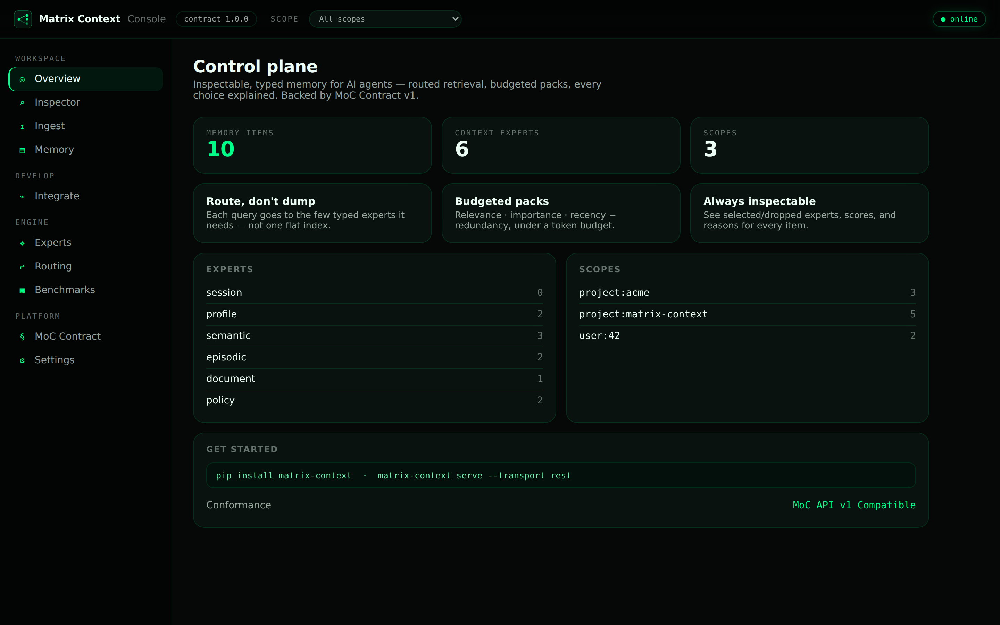
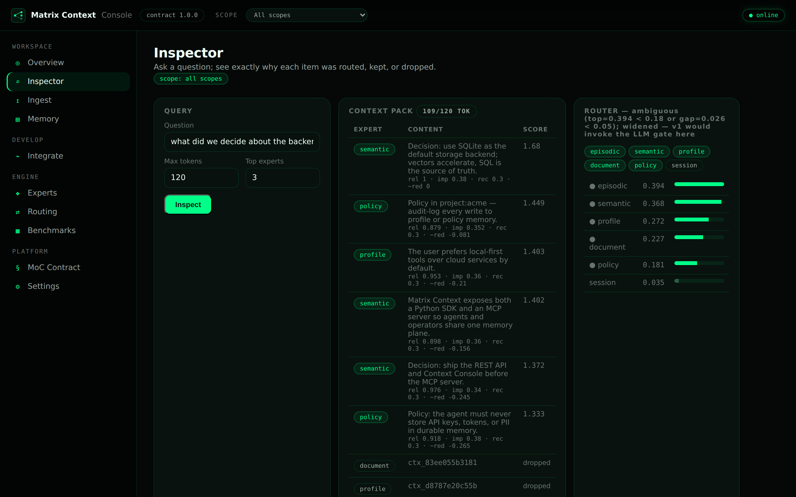
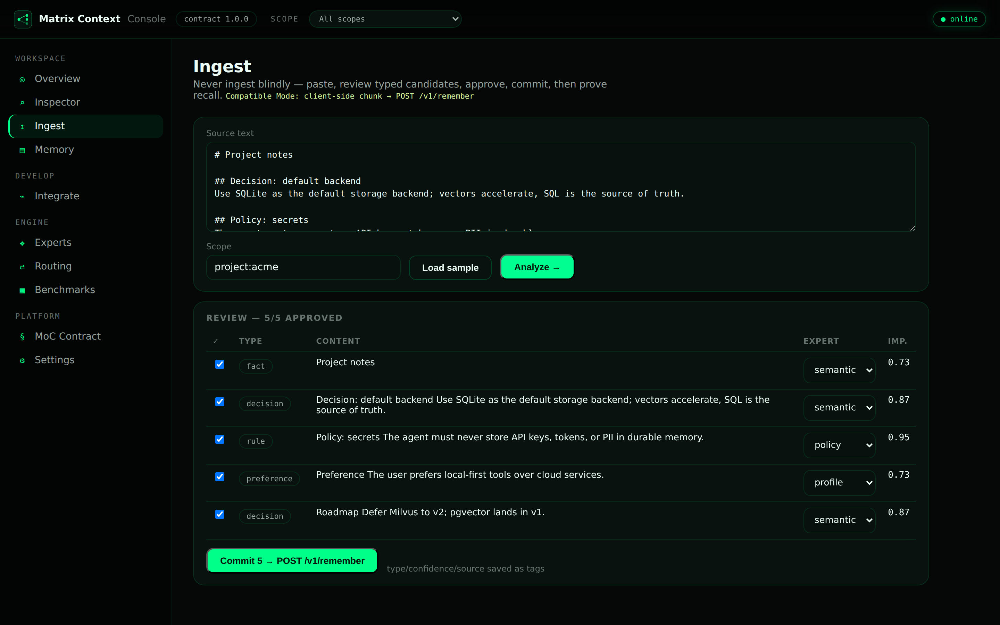
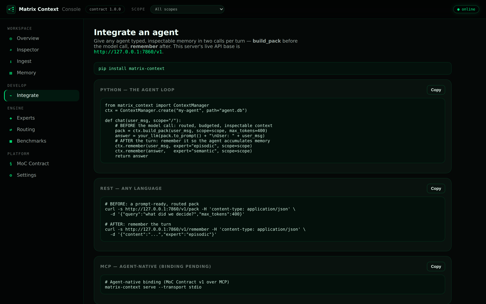
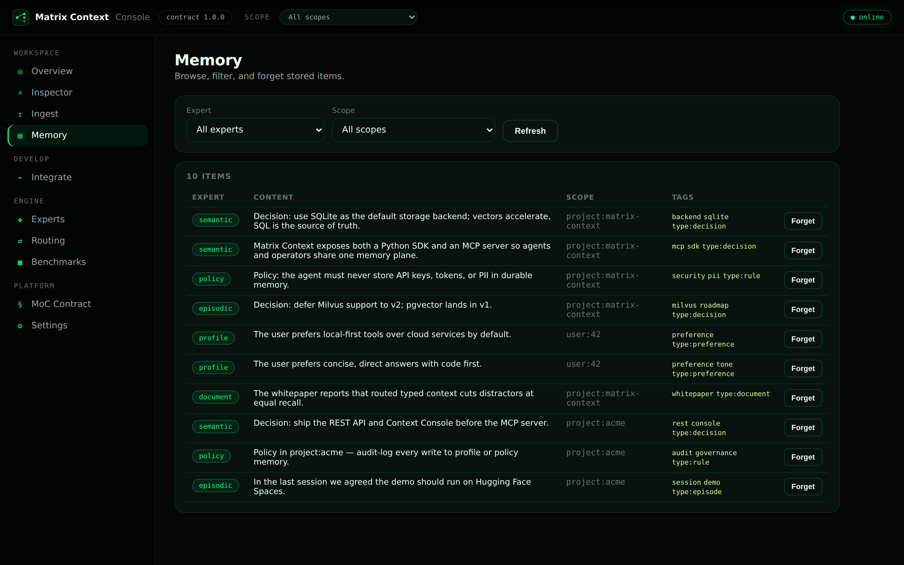
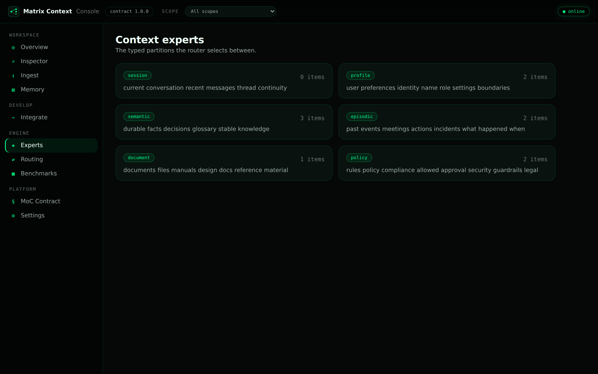
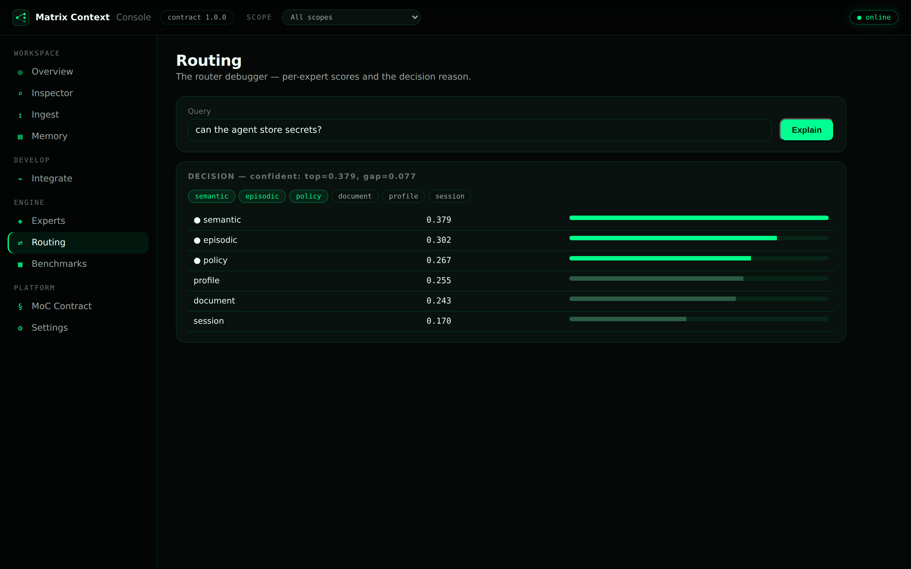
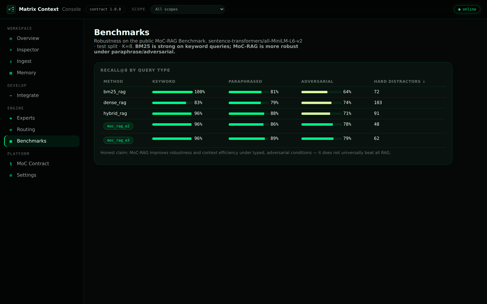
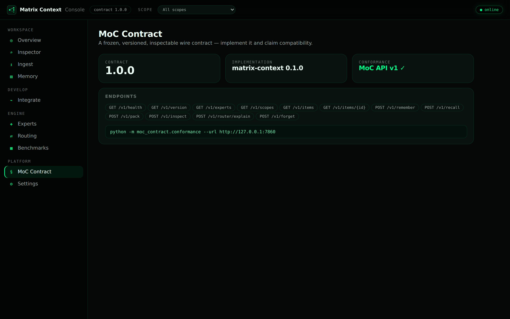
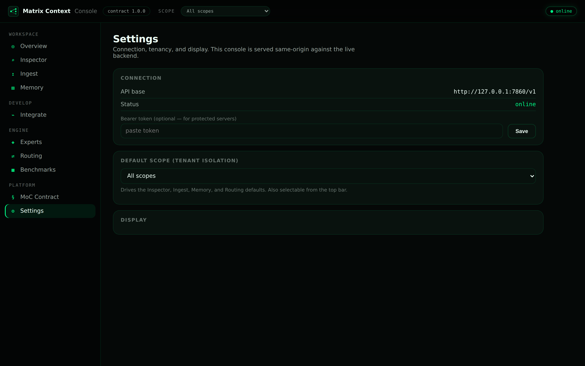

# Tutorials — Matrix Context

**Guides**

- **[Build your first chatbot](build-your-first-chatbot.md)** — beginner‑first, no API keys to start.
- **[Integrate with LangChain, LangGraph & CrewAI](integrate-frameworks.md)** — runnable framework demos (download a doc → ingest → query), plus advantages over flat RAG / a vector DB and enterprise scaling.
- **This page** — a visual walkthrough of the Console + a medical‑assistant demo.

---

A hands-on walkthrough of the **Matrix Context Console** (the live control plane /
admin UI) and a **medical chatbot** that uses Matrix Context as its memory — with
a quality check you can run yourself.

- Live demo (Hugging Face Space): `https://huggingface.co/spaces/ruslanmv/matrix-context-console`
- Run it locally:

```bash
pip install -e ".[dev]"
python frontend/server.py          # -> http://127.0.0.1:7860  (seeded demo memory)
```

The screenshots below were captured from a live run with
[`tutorials/shoot.py`](shoot.py) (Playwright + Chromium).

---

## 1. Overview

The control plane summarizes the memory store: item count, the typed **experts**,
the **scopes** (tenants/projects), and live backend status. The scope selector in
the top bar isolates everything to one team/project.



## 2. Inspector — the "why"

The centerpiece. Ask a question and see, live:

- **Router** (right): the per-expert scores and which experts were selected vs.
  skipped, with the decision reason.
- **Context pack** (center): the kept items with their full score breakdown
  (`relevance · importance · recency − redundancy`) and the items that were
  **dropped** — so nothing is a black box.
- The **prompt-ready pack** your model would actually receive.



## 3. Ingest — never ingest blindly

Paste content → **Analyze** splits it into typed candidates (decision, rule,
preference, …) with a suggested expert and importance → review/approve →
**Commit** writes each item via `POST /v1/remember` (metadata stored as tags).
Then "Test recall" proves it with the Inspector.



## 4. Integrate — give any agent memory in two calls

Copy‑paste snippets wired to **this** server's live API: `build_pack` before the
model call, `remember` after — in Python, REST (any language), or MCP.



## 5. Memory, Experts, Routing, Benchmarks

| | |
|---|---|
| **Memory** — browse, filter by expert/scope, and forget items |  |
| **Experts** — the typed partitions the router chooses between |  |
| **Routing** — the router debugger (scores + reason) |  |
| **Benchmarks** — measured robustness (keyword / paraphrased / adversarial) |  |
| **MoC Contract** — version, endpoints, conformance |  |
| **Settings** — connection, bearer token, default scope |  |

---

## 6. Demo: a medical assistant that uses Matrix Context

[`examples/medical_chatbot.py`](../examples/medical_chatbot.py) shows the value in
a safety-critical domain. Patient facts go to the `profile` expert and clinical
rules to `policy`; **both are pinned**, so `build_pack(query,
pin_experts=("profile","policy"))` guarantees allergies and safety rules are
recalled on *every* turn and never dropped.

```bash
python examples/medical_chatbot.py
# optional, real answers:  ANTHROPIC_API_KEY=… python examples/medical_chatbot.py --llm
```

It grounds answers on the recalled, typed pack and runs a contraindication check
over it. For example:

```
patient/clinician> Can I prescribe amoxicillin for the sinus infection?
assistant> ⚠️ CONTRAINDICATED: amoxicillin is a penicillin-class drug and the
           patient is allergic to penicillin (anaphylaxis). Do not prescribe.
```

### Verifying the quality of the results

The script ends with a labeled quality check — each query must recall the right
typed memory, and the safety flags must fire when (and only when) appropriate:

```
=== Quality verification ===
  [PASS] Is the patient allergic to anything?
  [PASS] What medications is the patient taking?
  [PASS] Can I prescribe amoxicillin for the sinus infection?
  [PASS] Can the patient take ibuprofen for pain?
  [PASS] What is the first-line treatment for type 2 diabetes?
  [PASS] What was the patient's last HbA1c?

Quality: 6/6 cases passed (all recalls grounded + safety flags correct)
```

This is the core claim made concrete: **typed, pinned, inspectable memory means
the assistant reliably recalls the safety-critical context** — and you can prove
it, per query, with `inspect()`.

---

## Reproduce the screenshots

```bash
python frontend/server.py &                 # serve the app
python -m pip install playwright && python -m playwright install chromium
python tutorials/shoot.py                     # -> tutorials/screenshots/*.png
```

Playwright is transient tooling, not a project dependency.
