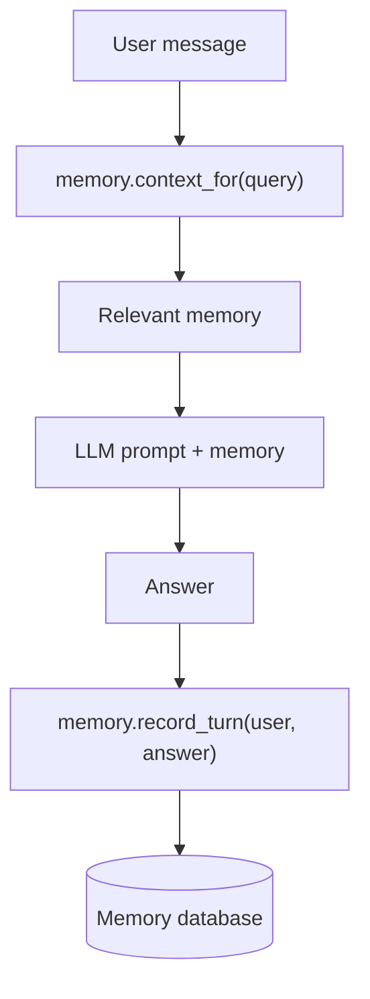

# Build your first chatbot with memory using Matrix Context

*A beginner-friendly guide to `memory.add`, `memory.ask`, and `memory.inspect`.*

Most chatbots forget useful details. In this guide, you will build a chatbot that
**remembers facts and uses them later** — step by step, starting from zero. No
prior knowledge of AI, RAG, SDKs, or REST is required. The first working example
needs **no API keys**.

> **Goal:** in under 10 minutes you'll understand and run the Matrix Context
> memory loop.

---

## 1. What are we building?

A tiny chatbot that:

1. **remembers** a fact you tell it, and
2. **uses** that fact to answer a question later.

We'll start with a *fake* AI (so it runs instantly, no keys), then swap in a real
model.

## 2. What problem does Matrix Context solve?

```text
A normal chatbot forgets.
Matrix Context gives the chatbot memory.
Before the bot answers, Matrix Context finds useful memory.
After the bot answers, Matrix Context saves what happened.
```

**Without Matrix Context** — the bot forgets previous useful facts:

```text
User
  ↓
Chatbot
  ↓
LLM
  ↓
Answer        ← no memory of earlier facts
```

**With Matrix Context** — the bot recalls the right facts and learns:

```text
User
  ↓
Matrix Context        ← finds useful memory
  ↓
Relevant memory
  ↓
Chatbot / LLM
  ↓
Answer
  ↓
Matrix Context        ← remembers the turn
```

## 3. How chatbot memory works

Every chat turn has **three steps**:

```text
1. User asks a question.
2. Matrix Context finds useful memory.
3. The chatbot answers and saves new memory.
```

As a diagram:



## 4. Install Matrix Context

```bash
pip install matrix-context
```

That's it — no other services, no API keys, no cloud.

## 5. Create a tiny chatbot

Here is the **whole thing**. Save it as `bot.py` and run `python bot.py`.

```python
import matrix_context as mc

# 1) Open memory (a small local file)
memory = mc.open("my-first-chatbot")

# 2) Teach it one fact
memory.add("The team uses Postgres for production.")

# 3) A *fake* AI so we can run with no API keys
def fake_llm(prompt: str) -> str:
    if "Postgres" in prompt:
        return "The team uses Postgres for production."
    return "I do not know yet."

# 4) One chat turn = find memory -> answer -> remember
def chat(user_message: str) -> str:
    context = memory.context_for(user_message)   # BEFORE: find useful memory

    answer = fake_llm(f"""
You are a helpful chatbot.

Useful memory:
{context}

User:
{user_message}

Answer:
""")

    memory.record_turn(user_message, answer)     # AFTER: learn the turn
    return answer

print(chat("What database do we use?"))
# -> The team uses Postgres for production.
```

**Line by line:**

- `mc.open("my-first-chatbot")` opens (or creates) a memory store at
  `.matrix-context/my-first-chatbot.db`.
- `memory.add("...")` saves one fact.
- `memory.context_for(user_message)` finds the most useful memory for this
  question and returns it as ready-to-use text (it's the same as `memory.ask`,
  just a name that reads naturally inside an agent loop).
- `memory.record_turn(user_message, answer)` saves both sides of the turn so the
  bot keeps learning.

> **Three levels, one engine.** `mc.open` is the beginner API. Agent developers
> use `context_for` / `record_turn` (above). When you need full control, the
> advanced API is right underneath — `memory.ctx` *is* a `ContextManager`, so
> `memory.ctx.build_pack(query, scope="user:42", max_tokens=400)` works too.

## 6. Add your first memory

You already did — this line:

```python
memory.add("The team uses Postgres for production.")
```

You can add as many as you like. Each one is a small, typed fact. Want a
category or a per-user partition? Pass `expert=` or `scope=`:

```python
memory.add("The team uses Postgres.", expert="project")
memory.add("The user prefers concise answers.", scope="user:42")
```

## 7. Ask a question that uses memory

```python
print(memory.ask("What database do we use?"))   # for a human to read
print(chat("What database do we use?"))          # through the bot
# -> The team uses Postgres for production.
```

Even though your question never said "Postgres", Matrix Context found the fact
for you and put it in front of the model.

```text
Saved memory:
"The team uses Postgres for production."

User asks:
"What database do we use?"

Matrix Context retrieves:
"The team uses Postgres for production."

Bot answers:
"The team uses Postgres for production."
```

## 8. Inspect why the memory was used

When something is recalled (or *not*), you can see exactly why:

```python
print(memory.inspect("What database do we use?"))
```

```text
ROUTING: selected experts: ['project_memory', ...]
PACK (… tokens):
  [project_memory] score=… :: The team uses Postgres for production.
  DROPPED [...] unrelated session memories
```

`inspect` shows which **expert** (memory category) was selected, which memory was
**kept**, and what was **dropped** — so you're never guessing.

---

## The Matrix Context pattern

> **This is the whole idea. Two calls per turn:**
>
> ```python
> # BEFORE the model answers:
> context = memory.context_for(user_message)
>
> # AFTER the model answers:
> memory.record_turn(user_message, answer)
> ```

- **`context_for`** (a.k.a. `ask`) means: *"Find useful memory for this question."*
- **`record_turn`** means: *"Save both sides of the turn for the future."*
- **`inspect`** means: *"Show me why this memory was selected."*

---

## 9. Add a real LLM

Once the fake version works, replace `fake_llm` with a real model. Pick **one**.

### Option A — Anthropic

```bash
pip install anthropic
export ANTHROPIC_API_KEY=sk-ant-...
```

```python
import anthropic
def llm(prompt: str) -> str:
    msg = anthropic.Anthropic().messages.create(
        model="claude-sonnet-4-6", max_tokens=400,
        messages=[{"role": "user", "content": prompt}],
    )
    return msg.content[0].text
```

### Option B — OpenAI

```bash
pip install openai
export OPENAI_API_KEY=sk-...
```

```python
from openai import OpenAI
def llm(prompt: str) -> str:
    r = OpenAI().chat.completions.create(
        model="gpt-4o-mini",
        messages=[{"role": "user", "content": prompt}],
    )
    return r.choices[0].message.content
```

Then use `llm(prompt)` instead of `fake_llm(prompt)` in your `chat()` function.

## 10. Use a local model with Ollama

No API key, runs on your machine.

```bash
# install Ollama from https://ollama.com, then:
ollama pull qwen2.5:0.5b
pip install ollama
```

```python
import ollama
def llm(prompt: str) -> str:
    return ollama.generate(model="qwen2.5:0.5b", prompt=prompt)["response"]
```

## 11. Use the REST API instead of the Python SDK

Use the **Python SDK** if your chatbot is written in Python. Use the **REST API**
if your app is written in JavaScript, Go, Java, or another language.

```text
JavaScript app
  ↓ HTTP
Matrix Context server
  ↓
Memory database
```

Start the server:

```bash
mc serve --transport rest --port 8088
```

The same two calls per turn, now over HTTP:

```bash
# BEFORE: find useful memory
curl -s localhost:8088/v1/pack -H 'content-type: application/json' \
  -d '{"query":"What database do we use?","max_tokens":400}'

# AFTER: remember the turn
curl -s localhost:8088/v1/remember -H 'content-type: application/json' \
  -d '{"content":"User asked about the database","expert":"session_memory"}'
```

And to debug:

```bash
# WHY: see which memory was selected
curl -s localhost:8088/v1/inspect -H 'content-type: application/json' \
  -d '{"query":"What database do we use?"}'
```

> Tip: the server also serves a visual **Inspector** at `http://localhost:8088/`
> and a full **Console** at `/console`.

## 12. Scaffold it automatically (agent-generator)

If you use [agent-generator](https://github.com/ruslanmv/agent-generator), it can
emit a wired memory module for you:

```python
from matrix_context.adapters.agent_generator import emit_template
t = emit_template("Support chatbot with memory", framework="react")
print(t.files["matrix_memory.py"])   # build_context() + record_turn() = the two calls
```

## 13. Common mistakes

```text
Mistake 1 — Only calling remember, never build_pack.
  The bot saves memory but never uses it.

Mistake 2 — Calling build_pack, never remember.
  The bot uses old memory but never learns anything new.

Mistake 3 — Saving everything with high importance.
  Memory becomes noisy and the useful facts get crowded out.

Mistake 4 — Not using scope.
  Memories from different users or projects get mixed together.

Mistake 5 — Never using inspect.
  You can't debug why the bot remembered (or forgot) something.
```

## Production tips (still simple)

```text
Separate users with scope:
  memory.context_for(msg, scope="user:42")
  memory.add(msg, scope="user:42")

Use importance for durable facts:
  high: memory.add("The user prefers short answers.", importance=0.9)
  low:  memory.add("User said hello.", importance=0.2)

Use ttl for temporary facts (seconds):
  memory.add("User is debugging an install issue.", ttl=3600)

Keep max_tokens small:
  start with 200–400.

Use inspect while developing:
  it shows what Matrix Context is doing.
```

---

## Tiny glossary

| Term | In plain words |
|------|----------------|
| **LLM** | The AI model that writes the answer (Claude, GPT, a local model…). |
| **Memory** | Facts or events the chatbot can reuse later. |
| **Context** | The useful information sent to the LLM before it answers. |
| **Context pack** | A small bundle of the most relevant memory, within a token budget. |
| **Expert** | A *category* of memory — e.g. user profile, project facts, decisions, past conversation. (Experts are just labels; the built-in set is `session`, `profile`, `semantic`, `episodic`, `document`, `policy`, and you can use your own like `project`.) |
| **`memory.add`** | Saves a fact (or ingests a file/URL via the CLI). |
| **`memory.ask` / `memory.context_for`** | Finds the right memory **before** the model answers (returns prompt-ready text). |
| **`memory.record_turn`** | Saves both sides of a turn **after** the model answers. |
| **`memory.inspect`** | Shows **why** Matrix Context picked certain memories. |

## Next steps

- See the visual **[Console walkthrough](README.md)** (Inspector, Ingest, Memory…).
- A safety-critical example: **[`examples/medical_chatbot.py`](../examples/medical_chatbot.py)**
  (a medical assistant whose allergies/rules are always recalled — with a quality check).
- The full API and the open standard: **[`moc_contract/`](../moc_contract/README.md)**.
